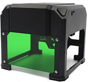

# Vectorial Driver for Mini Laser Engraver


This printer model comes with a program (scrave) that only print black and white images with slow scanning moves.

This program is the result of a retro enginering work to print SVG vector paths on this machine.

## How to use

### Create an SVG file
1. Open your favorite SVG editor. (Like [Inkscape](http://inkscape.org/))
2. Create a 50mm x 50mm document and draw path on it.
    - Path stroke color should be in grayscale and will be interpreted as engraving depth.
    - If you want to print a text, select it and use the _convert to path_ function.
3. Save the SVG file.

### Compatibility
- Windows: Tested
- Linux/Mac: Need serial port implementation in [SerialPort.hpp](https://github.com/nesnes/VectorialLaserEngraver/blob/master/include/SerialPort.hpp). (and chase the last _Sleep()_ calls)

### Functionalities
- Auto printer discovery and connection hover serial port
- Preview the print area
- Set the laser power and engraving depth
- Print images. (uint8 buffers)
- Print shapes.
- Print SVG files
- Simulate the printer by printing in an OpenCV windows. (No printer required)

### Sample Code
```cpp
#include <iostream>
#include <stdio.h>
#include <stdlib.h>
#include <string.h>
#include "LaserPrinter.hpp"
#include "SVGParser.hpp"

int main(int argc, char **argv) {
  bool simulate = false;
  LaserPrinter printer("auto", simulate);
  if(!printer.isConnected()) {
      std::cout << "Laser printer not found" << std::endl;
      exit(1);
  }

  int width, height;
  std::vector<LaserPrinterSegment> svgSegments = SVGParser::getSegments("github.svg", width, height);
  if(svgSegments.size() == 0) {
      std::cout << "Invalid file" << std::endl;
      exit(1);
  }
  printer.setPrintOrigin(0, 0);
  printer.startAreaPreview(width, height);
  Sleep(5000);
  printer.stopAreaPreview();
  printer.setLaserPower(1.f); // 100%
  printer.setEngravingDepth(0.6f); // 60%
  printer.printShape(svgSegments, width, height, true);

  std::cout << "Type a character to close: " << std::endl;
  char wait;
  std::cin >> wait;
  return 0;
}
```
